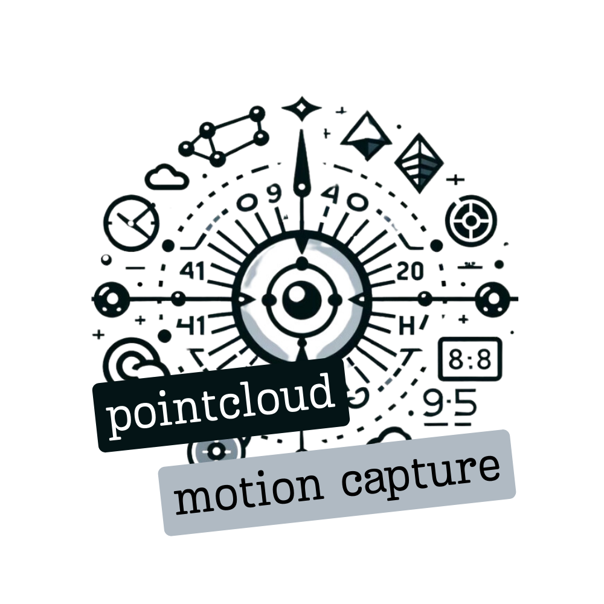

# Pointcloud Motion Capture

<p align="center">
  
</p>


Pointcloud Motion Capture is a ROS 2 package designed to process point clouds for capturing object movements. It detects objects using color filters and infers data about their position, velocity, and acceleration. 
*This package was developed and tested in ROS 2 Humble.*

## Installation

Clone the repository into your ROS 2 workspace and build the package:

```bash
cd <your_ros2_workspace>/src
git clone https://github.com/vitorsmends/pointcloud_motion_capture.git
```

### Install libraries
To successfully compile and run this ROS 2 package, ensure that you have the following libraries installed on your system:

- **PCL (Point Cloud Library)**: PCL is a powerful open-source library for 3D point cloud processing. You can download and install PCL from the [official PCL website](https://pointclouds.org/downloads/).

- **yaml-cpp**: yaml-cpp is a YAML parser and emitter in C++. You can find the source code and installation instructions on the [yaml-cpp GitHub repository](https://github.com/jbeder/yaml-cpp).

### Install dependencies
To install the ros packages that were used, type:
```bash
rosdep install --from-paths src -y --ignore-src
```

## Usage

### Launching the Package

To launch the motion capture system, run the following command:

```bash
ros2 launch pointcloud_motion_capture motion_capture.launch.py
```

### Configuration

The package comes with a configuration file for color filters. You can adjust the color filters by modifying the `colors.yaml` file located in the `config` directory.

### Nodes

The package consists of the following nodes:

- `motion_capture.cpp`: Node responsible for capturing object motion.
- `point_cloud_reader.cpp`: Node for reading point cloud data.

These nodes subscribe to the `/camera/camera/depth/color/points` topic of type `sensor_msgs/msg/PointCloud2` by default. The package has been tested using an Intel RealSense D435i depth camera.

## Contributing

Contributions to the development of this package are welcome! If you have any suggestions, feature requests, or bug fixes, please feel free to open an issue or submit a pull request.

## License

This project is licensed under the [MIT License](LICENSE), which means you're free to use, copy, and modify the code, subject to certain conditions. See the LICENSE file for more details.

## Contact

- **Email:** [vitor.mendes@ieee.org](My Email: vitor.mendes@ieee.org)
- **LinkedIn:** [https://www.linkedin.com/in/vitorsmends/](LinkedIn)
